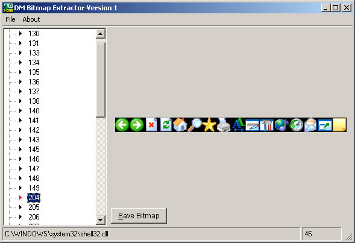



## DM Bitmap Extractor

### Description

DM Bitmap Extractor is a small project I made about 2 hours ago that will allow you to open a file type of Dll EXE or OCX files and View and Save the Bitmaps inside them.

This is handy if you ever need toolbar bitmaps or what ever else you may find usfull. anyway all the code is commented on evey line. Please Vote and give feedback. Hope you like the code.
 
### More Info
 

             |
---                |---
**Submitted On**   |2001-11-24 08:34:06
**By**             |[dreamvb](https://github.com/Planet-Source-Code/PSCIndex/blob/master/ByAuthor/dreamvb.md)
**Level**          |Intermediate
**User Rating**    |5.0 (55 globes from 11 users)
**Compatibility**  |VB 4\.0 \(16\-bit\), VB 5\.0, VB 6\.0
**Category**       |[Complete Applications](https://github.com/Planet-Source-Code/PSCIndex/blob/master/ByCategory/complete-applications__1-27.md)
**World**          |[Visual Basic](https://github.com/Planet-Source-Code/PSCIndex/blob/master/ByWorld/visual-basic.md)
**Archive File**   |[DM\_Bitmap\_18217511252004\.zip](https://github.com/Planet-Source-Code/dreamvb-dm-bitmap-extractor__1-57411/archive/master.zip)

